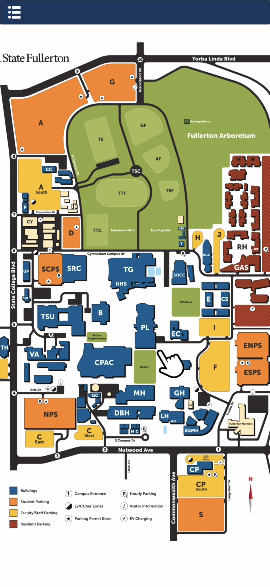
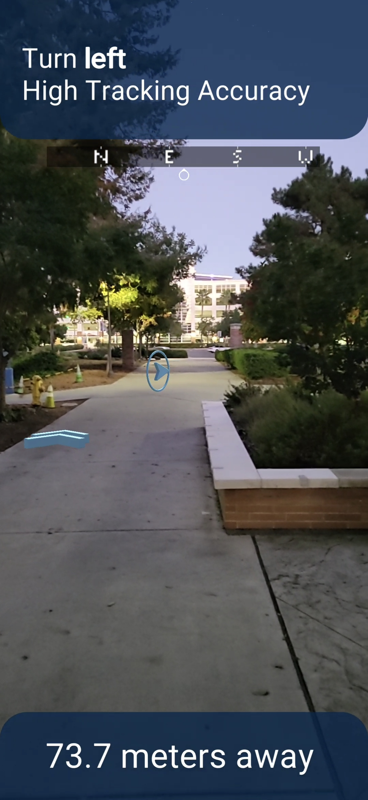
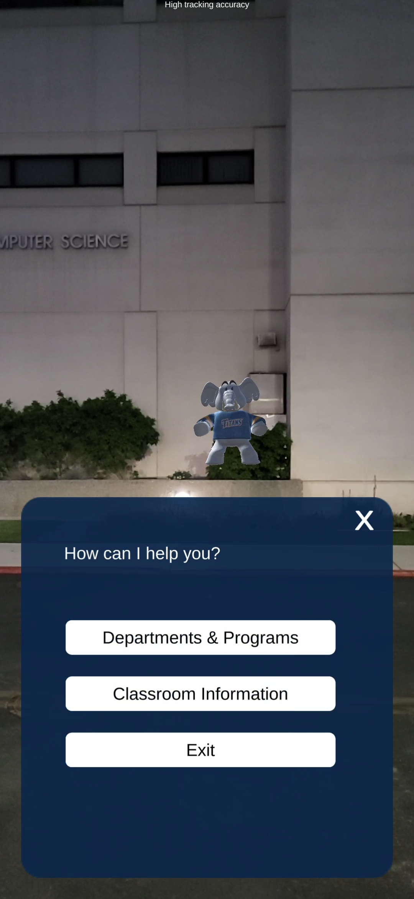

# CampusGuide AR

  
  
  

https://github.com/HRB-NO1/Titan-Campus-AR/assets/54606160/afa9698b-a62f-4372-9bbe-a9ad87e28cee

### Note
For optimal utilization within the Unity editor, it is recommended to commence with the Menu Scene as the initial point of interaction.

### Requirements for Developing
* A computing system operating on Windows or macOS platforms.
* Compatibility with Unity version 2021.3.12f1 is required for project integration.

### Requirements for AR Sample Project
* An Android mobile device equipped with a camera, GPS functionality, and Internet connectivity is mandatory for the application’s operation.

## Features

**Map Scene**
* [GoogleMapStyleGesture](https://github.com/HRB-NO1/Titan-Campus-AR/blob/main/titan-ar-tour/Assets/Menu%20Related/GoogleMapStyleGesture.cs) - Designed for a Unity application and provides an interactive map interface with zoom and drag functionalities akin to those found in Google Maps. Users can zoom in and out of the   map using pinch gestures and drag to navigate different areas of the campus, with the map's view adjusting responsively in a smooth and intuitive manner. Mouse scroll compatibility was added to simplify development testing procedures.

**AR Nav**
* [NavigationCalculator](https://github.com/HRB-NO1/Titan-Campus-AR/blob/main/titan-ar-tour/Assets/AR%20Nav%20Related/Scripts/NavigationCalculator.cs) - Designed to perform geospatial computations necessary for augmented reality (AR) navigation applications. It encapsulates a set of static methods that facilitate the calculation of distances and bearings between two geographical coordinates.
* [NavigationManager](https://github.com/HRB-NO1/Titan-Campus-AR/blob/main/titan-ar-tour/Assets/AR%20Nav%20Related/Scripts/NavigationManager.cs) - Designed for AR navigation applications to provide users with real-time turn-by-turn navigation within a virtual representation of a campus environment, using the Google Maps API to translate geographical coordinates into a sequence of navigational steps and visual cues.
* [ProprietaryStructs](https://github.com/HRB-NO1/Titan-Campus-AR/blob/main/titan-ar-tour/Assets/AR%20Nav%20Related/Scripts/ProprietaryStructs.cs) - Designed to facilitate augmented reality navigation by encapsulating geolocation data and directional information. These data structures are integral to managing and interpreting GPS coordinates, providing the necessary orientation and step-by-step guidance for AR wayfinding in a campus setting.
* [SampleScript](https://github.com/HRB-NO1/Titan-Campus-AR/blob/main/titan-ar-tour/Assets/AR%20Nav%20Related/Scripts/SampleScript.cs) - A component that manages geospatial navigation by utilizing Google's ARCore Extensions. It calculates and displays a series of navigational steps and intermediary points in the physical world as visual markers, guiding users towards a designated destination with real-time updates and adjustments based on the user's actual geographic position and orientation.
* [UIController](https://github.com/HRB-NO1/Titan-Campus-AR/blob/main/titan-ar-tour/Assets/AR%20Nav%20Related/Scripts/UIController.cs) - Manages the user interface for an augmented reality navigation application. It controls various UI elements like labels and buttons to display navigation instructions, distance to the destination, and manages scene transitions. The class also handles user inputs for setting destinations and updates the UI accordingly, enhancing user interaction and experience in an AR context.

**AR Tuffy**
* [SampleScript](https://github.com/HRB-NO1/Titan-Campus-AR/blob/main/titan-ar-tour/Assets/AR%20Tuffy%20Related/SampleScript.cs) - Designed for an AR application. It utilizes Google's ARCore Extensions and ARFoundation to handle geospatial data and AR interactions. The script is responsible for initializing and managing AR objects in the real world based on predefined geographical locations. It also integrates dialogue interactions and user interface elements to enhance the AR experience, providing users with contextual information and navigation assistance within the AR environment.

**Shared Scripts Utilized in Both AR Nav and AR Tuffy**
* [SceneSwitcher](https://github.com/HRB-NO1/Titan-Campus-AR/blob/main/titan-ar-tour/Assets/AR%20Tuffy%20Related/AR_Fukuoka/Scripts/SceneSwitcher.cs) - Designed to handle scene transitions within a Unity application.

## Instructions

**Android Installation Instructions for Titan Campus AR**
1. *Download the APK File:*
   * Locate the [Titan Campus AR.apk](https://github.com/HRB-NO1/Titan-Campus-AR/blob/main/Titan%20Campus%20AR.apk) file in the repository.
   * Download the .apk file to your Android device.

2. *Install the Application:*
   * Once downloaded, tap on the Titan Campus AR.apk file from your device's download folder
   * Your device may ask for permissions to install applications from unknown sources. Please allow this permission to proceed.
   * Follow the on-screen instructions to complete the installation.
     
3. *Install the Application:*
   * After installation, open Titan Campus AR from your device’s app drawer.
   * The application is now ready for use.

4. *Confirm the Import:*
   * A dialog will appear showing all the files to be imported. By default, all files should be selected.
   * Verify that all the necessary files are checked. If you only need certain parts of the package, you can uncheck the items you don't want to import.
   * Click on the Import button to start the import process.
     
**Instructions for Importing Titan Campus AR Unity Package**
1. *Download the Unity Package:*
   * Locate the [Titan Campus AR.unitypackage](https://github.com/HRB-NO1/Titan-Campus-AR/blob/main/Titan%20Campus%20AR.unitypackage) file in your GitHub repository.
   * Click on the file and use the download option provided by GitHub to save the .unitypackage file to your local machine.

2. *Open Unity:*
   * Launch the Unity Editor.
   * Open an existing project where you want to import the package, or create a new Unity project.

3. *Import the Unity Package:*
   * Once you have your project open in Unity, go to the top menu bar and click on Assets.
   * From the dropdown menu, select Import Package > Custom Package....
   * Navigate to the location where you downloaded Titan Campus AR.unitypackage.
   * Select the file and click Open.

5. *Wait for Unity to Complete the Import:*
   * Unity will now import all the selected items from the package into your project. This process may take some time depending on the size of the package and the speed of your computer.
   
6. *Verify the Imported Assets:*
   * Once Unity has finished importing, you can verify the assets by navigating to the Assets folder in the Project window within Unity.
   * Look for a folder with the name Titan Campus AR or similar, which should contain all the imported assets.

7. *Ready to Use:*
   * The assets from the package are now ready to use in your project. You can drag and drop the assets into your scene or reference them in your scripts as needed.
   
**Instructions for Opening the Project from the Disk**
1. *Clone the Repository:*
   * Navigate to the GitHub page for the [titan-ar-tour](https://github.com/HRB-NO1/Titan-Campus-AR/tree/main/titan-ar-tour) project.
   * Click on the 'Code' button and copy the URL to clone the repository.

2. *Open Unity Hub:*
   * Launch Unity Hub on your machine.
   * Go to the 'Projects' tab.

3. *Add the Project:*
   * Click on the 'Add' button.
   * Browse to the location where you cloned the titan-ar-tour repository.
   * Select the folder and Unity Hub will add it to your projects list.

4. *Open the Project:*
   * Click on the titan-ar-tour project in Unity Hub to open it with Unity Editor.
   * If Unity prompts you to upgrade the project to your current version of Unity, create a backup and proceed with the upgrade if you wish. Otherwise, continue with the project's current version if it's    * compatible with your Unity Editor version.

## Resources

* [ARCore](https://developers.google.com/ar)
* [Unity's documentation](https://docs.unity.com/)

## Issues

Find a bug or want to request a new feature?  Please let us know by submitting an issue.

## Licensing

* [ARCore](https://developers.google.com/ar)
* [Unity's documentation](https://docs.unity.com/)
